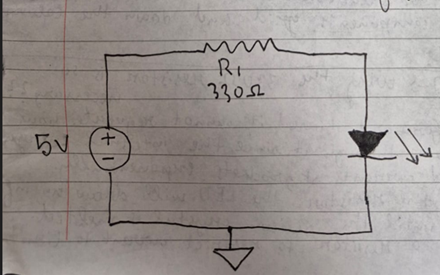

# Project 1: Introduction to Arduino, Semiconductor Physics Principles, and Single LED Circuit Analysis

### 1. Hardware Prototyping & Visual Layout
Attached below is the physically deployed hardware layout and demonstration of the working LED.

---

### 2. Deep-Dive Semiconductor Physics & PN-Junction Dynamics to ensure LED safety
Our circuit utilises a 330ohm resistor to limit current and ensure safety, this is due to the following reasons:
An LED is not a basic linear resistor unlike incandescent bulbs (which rely on heating the wire white hot); it is a non-linear, solid-state semiconductor device which greatly optimisises energy consumption since most of the energy is utilised to generate light, not heat. Understanding its behavior requires analyzing its atomic structure:
* **The PN Junction:** The diode is constructed by joining P-type semiconductor material (abundant with positive electron holes) and N-type semiconductor material (packed with free electrons). The interface where they meet forms a **depletion region** with an internal electrostatic potential barrier.
* **The Voltage Gate:** An LED acts like a gate which requires a specific minimum voltage to switch (called the **Forward Voltage Drop** or $V_f$). For our standard Red LED, this gate opens at around $2.0\text{V}$. 
Once the LED is given enough voltage to open said gate, the current doesn't increase linearly, it spikes instantly. 
Because the LED has no built-in way to slow down or regulate how much current it takes, it will try to pull everything it can from the Arduino pin. Without a resistor in the way to lower that current , the LED will draw way too much power, overheat instantly, and burn itself out.
---

### 3. Introduction to Breadboard Mechanics & Electrical Routing
Based on the physical structure and the distribution of pins underneath the breadboard connecting various components and routing the flow of current:
* **The Distribution Rails:** The outer vertical column marked with a red line ($+$) and a blue/black line ($-$) acts as a continuous conducting strip extending down the entire length of the board. These are designed for both power injection and grounding multiple loops.
* **The Terminal Blocks (Component Grid):** The central rows (columns A-E and F-J) are wired in isolated horizontal groups of 5. These blocks run *perpendicular* to the power rails. This structural design ensures that inserting a component across two separate rows establishes distinct electrical nodes, allowing us to control the current path precisely between the microcontroller and ground.

### 4. Linear Circuit Analysis & Mathematical Design
To safely run a standard red LED from a 5V digital I/O pin, Ohm's Law ($V = IR$) was applied to calculate the ideal resistance for a target safe current range of $10\text{-}20\text{mA}$ ($0.01\text{A}$ to $0.02\text{A}$).

* **Given Parameters:**
  * $V_{\text{provided}} = 5\text{V}$
  * $V_{\text{required (LED drop)}} \approx 2\text{V}$
  * $V_{\text{resistor}} = 5\text{V} - 2\text{V} = 3\text{V}$

* **Theoretical Target Resistance:**
  $$R = \frac{3\text{V}}{0.01\text{A}} = 300\Omega \quad \text{or} \quad R = \frac{3\text{V}}{0.02\text{A}} = 150\Omega$$

Below is the verified loop schematic drawn during the initial circuit analysis phase:

* **Physical Implementation:**
  Using a standard, readily available $330\Omega$ manufacturer resistor from the kit, the exact loop current was derived:
  $$I = \frac{3\text{V}}{330\Omega} \approx 0.009\text{A} \quad (9\text{mA})$$
  This keeps the LED both bright and stable hence perfectly safe from overheating.

### How to Run
1. Clone this repository or copy the `.ino` file code.
2. Open the code in the official Arduino IDE.
3. Wire the circuit exactly as shown in the layout image.
4. Select your board type, port, and hit **Upload**.

**Additional Notes:**
When using these principles for multiple colored LEDs, I noticed that the blue LED was significantly brighter than the red one with the same resistor setup, looking into it, different colored LEDs use different semiconductor materials (like Gallium Nitride for blue vs. Gallium Arsenide for red), meaning they have different energy gaps and forward voltage drops.
