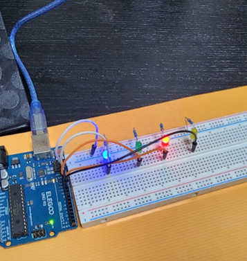

# Project 3: 4-Bit Binary Counter using LEDs

### 1. Project Objective
The goal of this project is to construct a physical 4-bit binary counter using an Elegoo Uno R3 and four independent LED channels consisting of the LED, appropriate resistors and grounded via distribution rails (similar but expanded to what I constructed previously) . The firmware cycles through Base-2 notation numbers from 0000 to 1111 (Decimal 0 to 15) to demonstrate how combinations of microscopic semiconductor gates represent numerical data in embedded computer architectures and systems.

---

### 2. Theoretical Principles: Base-10 vs. Base-2 Execution
While human counting and computation rely on the Decimal (Base-10) system using ten separate characters (0-9), microcontrollers operate purely via digital logic gates that alternate between the following discrete conductive states:
* **Logic LOW (0):** The transistor path behaves as an insulator, cutting off current (LED Off).
* **Logic HIGH (1):** The transistor path behaves as a conductor, completing the loop (LED On).
To handle values beyond a single digit without creating new symbols, a positional weight notation is utilized. In Base-2, each column moving left scales exponentially by a factor of 2 ($2^n$):

| LED Channel | Color | Hardware Bit Position | Bit Weight (Decimal) |
| :--- | :--- | :---: | :---: |
| `yellowLED` | Yellow | Bit 3 (MSB) | $2^3 = 8$ |
| `redLED` | Red | Bit 2 | $2^2 = 4$ |
| `greenLED` | Green | Bit 1 | $2^1 = 2$ |
| `blueLED` | Blue | Bit 0 (LSB) | $2^0 = 1$ |

By aggregating these four digital outputs, the system can compute and visually manifest $2^4 = 16$ unique electrical combinations.

---

### 3. Circuit Architecture & Hardware Layout
The implementation employs a parallel array design where every LED is assigned its own independent current-limiting resistor to protect the microchip pins from excessive current draw, ensure each LED can individually be programmed to either be switched on or off (something which would not be possible in a series arrangement) and to ensure uniform brightness.

* **Common Ground Bus:** The cathodes (short legs) of all four LEDs bridge directly into the negative power rail of the breadboard via 330ohm resistors, forming a unified ground plane routed back to the Arduino `GND` pin and hence completing the circuit loop.
* **Dedicated Control Matrix:** The anodes (long legs) route to dedicated digital input/output (I/O) pins on the microcontroller via jumper wires:
    * Pin 9 $\rightarrow$ Blue LED (LSB)
    * Pin 10 $\rightarrow$ Green LED
    * Pin 11 $\rightarrow$ Red LED
    * Pin 12 $\rightarrow$ Yellow LED (MSB)

#### Hardware Prototyping & Visual Layout
Below is the physically deployed 4-channel parallel circuit executing the binary sequence:

---

### 4. Firmware Optimization Details
The logic relies on precise state transitions executed sequentially inside the main `loop()` block. Each step represents an instantaneous change of state across all 4 output parameters, holding the display for exactly 1000 milliseconds before transitioning to the subsequent logical step.
---

### How to Run
1. Clone this repository or copy the `.ino` file code.
2. Open the code in the official Arduino IDE.
3. Wire the circuit exactly as shown in the layout image.
4. Select your board type, port, and hit **Upload**.

